# 人员管理项目

# 1.项目名称

**人员管理系统**

# 2.项目简介

> 此项目为基于Spring SpringMVC Mybatis搭建的人员管理系统

**技术点**

-   基础框架：SpringMVC+Spring+MyBatis

-   数据库：MySQL

-   数据库连接池: C3P0

-   前端框架：BootStrap快速搭建

-   项目依赖管理：Maven

-   逆向工程：MyBatis Generator

-   编译器:IDEA 2018.3.2

**功能分解**

1.  查询和显示

2.  新增员工信息功能

3.  修改员工信息功能

4.  单个删除员工

5.  搜索功能

# 3.项目分工

-

# 4.工作任务分配

表 2列出本项目组完成的主要模块及开发者。

表 2 项目模块及开发者明细


[^1]: 模块指用程序代码编写的方法或H5编写的页面等。如果是程序代码编写的方法，需列举该方法的参数及类型，返回参数类型及意义。如果用Java编写，还需著名所在的包名和类名。

```java
开发语言
```

# 5.开发过程

## 5.1数据库架构模块实现

功能描述：创建数据库 db_personnelmanagement.sql 创建表department employee user

运行与测试：


## 5.2SSM框架配置模块实现

功能描述：导入maven依赖,搭建Spring SpringMVC Mybatis jdbc 配置

运行与测试：导入maven依赖:

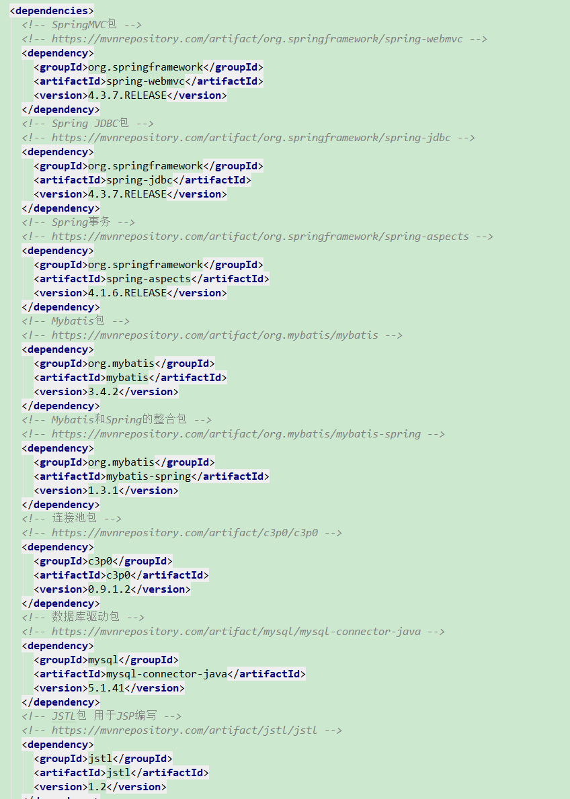

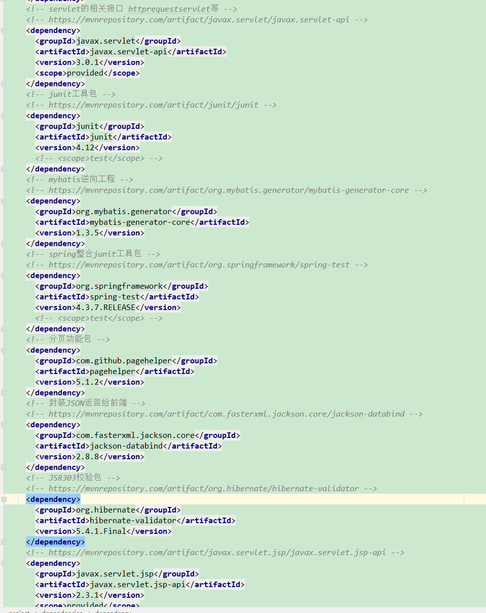

创建spring配置文件 application Context.xml

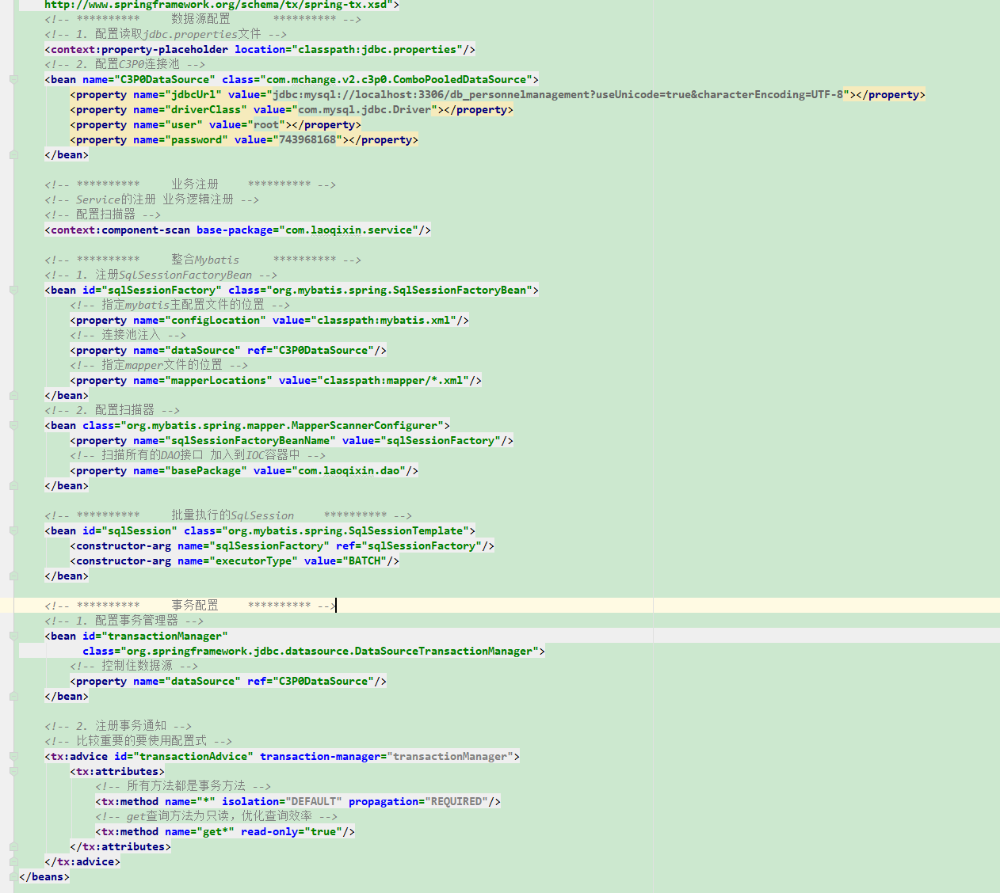

创建jdbc连接池:


SpringMvc配置:

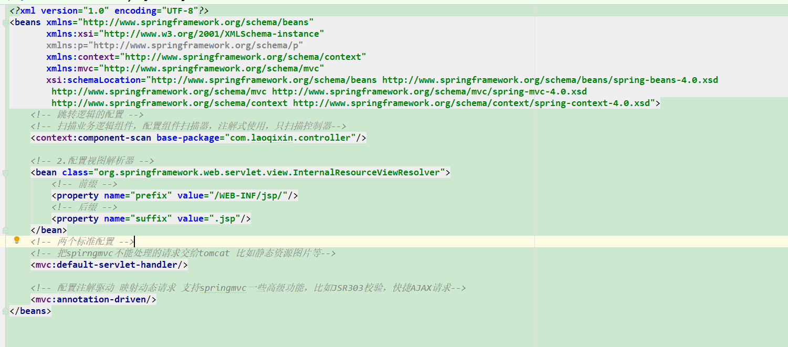

Mybatis配置:

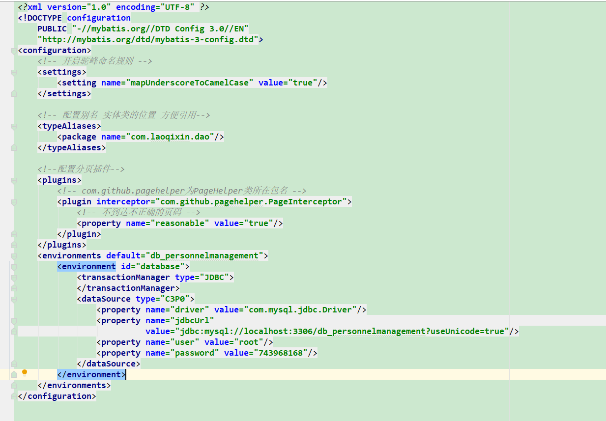

技术分析：applicationContext里面配置了c3p0连接池读取了jdbc配置文件
方便调用数据库连接属性;指定了mapper dao
service基础包的位置,配置SQLSessionFactory

jdbc配置文件里面指定了jdbc Driver 数据库的名称 用户名及其密码
最大和最小连接数,实现了jdbc封装 可以在resources下重复利用

mybatis ,maven导包等在图片里有注释

## 5.3 MyBatis Generator逆向工程模块实现

功能描述：使用mybatis-generator实现代码逆向生成,快速搭建数据库CRUD mapper

测试用例与测试过程：

创建逆向工程配置文件:

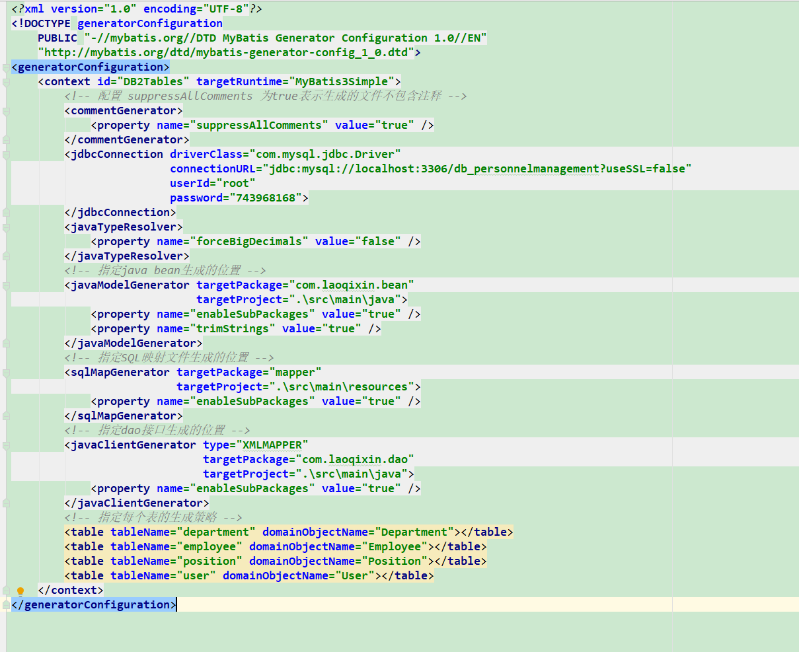

创建逆向工程运行文件:

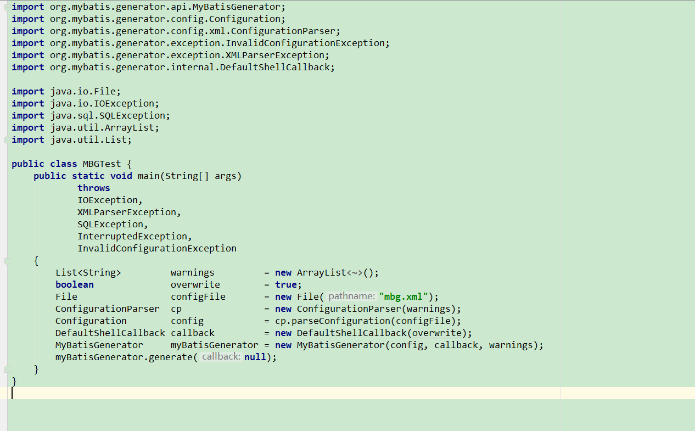

结果分析：

在逆向工程配置文件里面指定了数据库的连接,设置不生成封装ExampleBean,

制定了javabean,SQL映射文件,dao接口的生成位置,指定生成哪几个表,命名格式为驼峰命名

运行结果为下图的展开包:

(media/1f18d74a8fd5f6cd523d634286894b6e.jpg)


测试mapper是否可用:

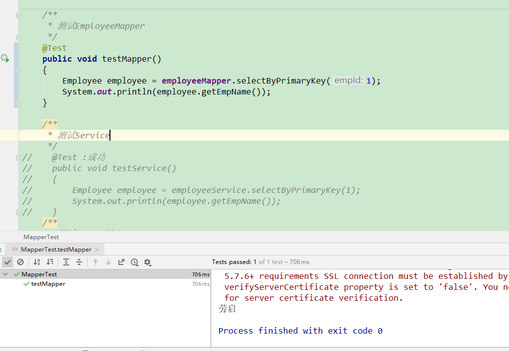

运用逆向工程自动生成的dao接口里的方法按主键查询员工信息,用员工Bean对象储存返回值,并取出查询到的员工姓名:劳启,测试成功

## 5.4员工增删查改模块实现

功能描述：编写service业务层,并在controller里面调用方法,实现用户与数据库之间的CRUD操作

运行与测试：

创建service包,并创建员工业务层EmployeeService.java

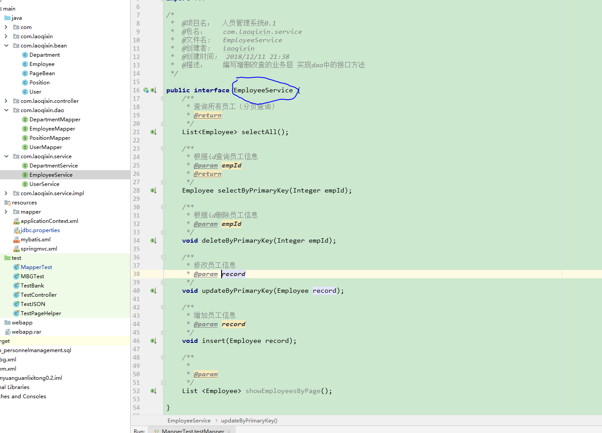

技术分析：

业务层里面实现了dao层接口的方法

实现类:EmployeeServiceImpl:

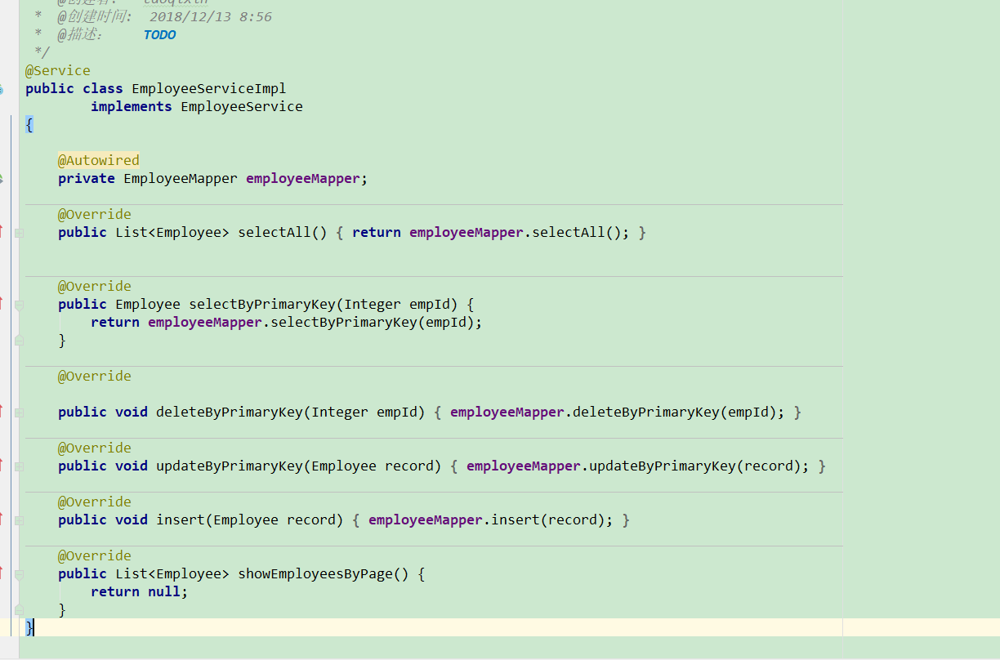

自动装配dao接口对象,用dao接口对象引用mapper映射文件对数据库进行CRUD

查询所有员工方法:

类型:List\<Employee\> 封装了员工Bean的list数组

返回参数:返回方法dao接口查询数据库的员工信息:List\<Employee\>

用主键查询员工信息方法:

参数:员工id

类型:员工类

返回参数:员工对象

按主键删除员工信息:

参数:员工id

按主键更新员工信息:

参数:员工对象

插入员工信息:

参数:员工对象

编写controller:

创建EmployeeController

具体方法介绍已在图中打注释:

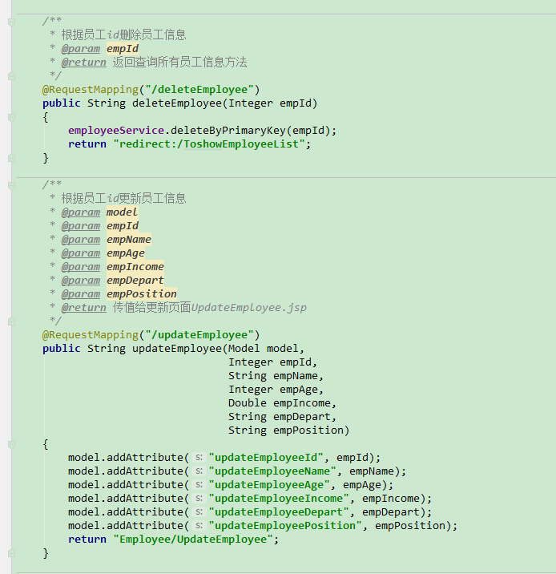

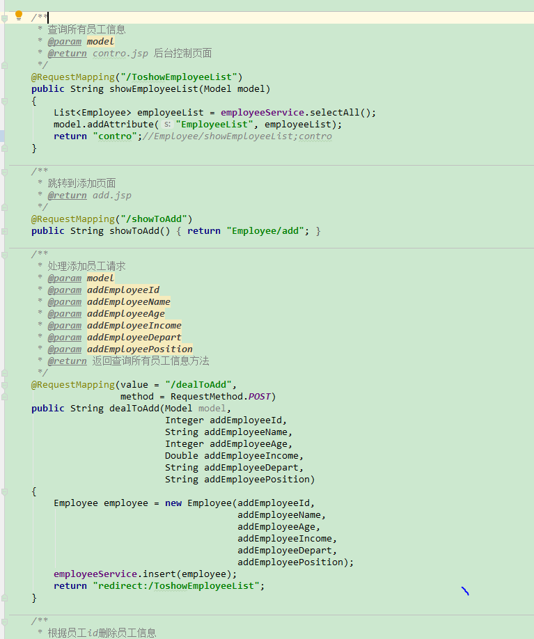

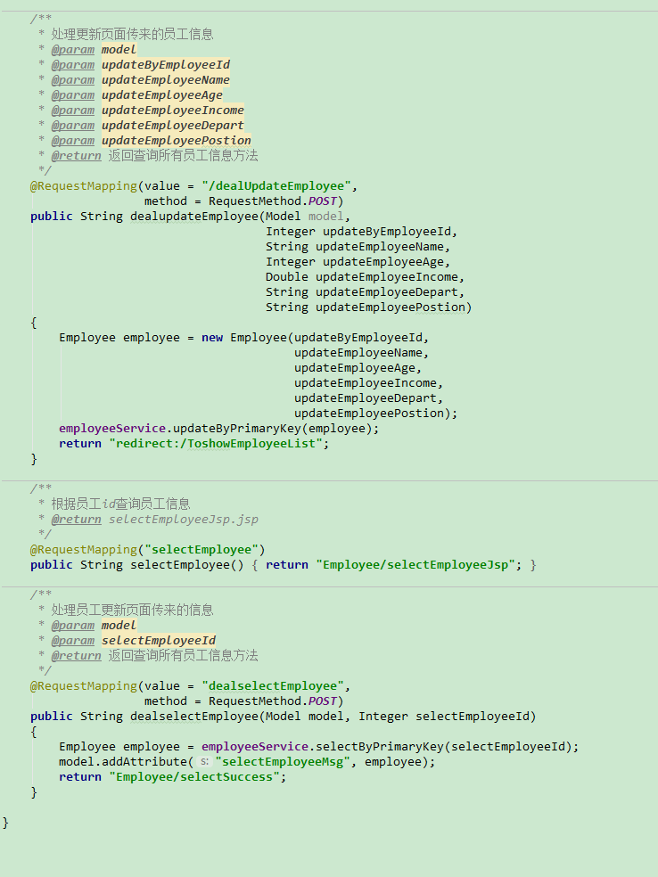

运行实现:

## 5.5部门增删查改模块实现

功能描述：编写service业务层,并在controller里面调用方法,实现用户与数据库之间的CRUD操作

运行与测试：service:

(media/6bd7f5053dae92dc75d757c8e06376a3.png)

C:\\Users\\sziit\\Desktop\\捕获.PNG

Controller:

(media/9c5c3f80ac8d776ac358cb1f784796c0.png)

C:\\Users\\sziit\\Desktop\\捕获.PNG

(media/3fd013208b8b4e13bb46b8527698e66e.png)

C:\\Users\\sziit\\Desktop\\捕获.PNG

(media/f7a03af39a67c6f324a53a103561a427.png)

C:\\Users\\sziit\\Desktop\\捕获.PNG

Dao:

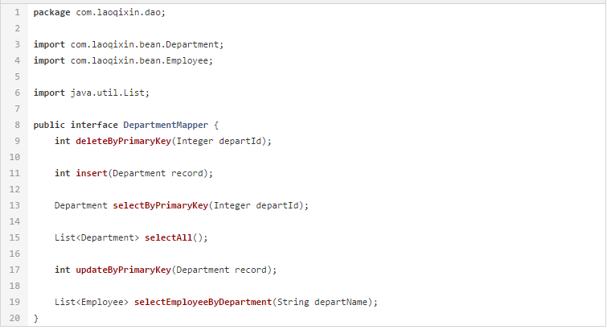

C:\\Users\\sziit\\Desktop\\捕获.PNG

技术分析：具体实现方法原理与**员工的增删改相同**

## 5.6登录页面模块实现

功能描述：管理员登陆功能实现，拦截管理员以外的用户

运行与测试：

(media/36477bed35ae0e3a3e26e67b587d5bd0.png)


## 5.7树搭建模块实现

功能描述：利用TreeView实现一个功能菜单，菜单本身可进行数据的基本操作，并且利用Json数据方式与树连接，实现动态的数据操作，菜单的一些点击响应事件。因技术和时间的原因，本人只是简单的实现一个树。

运行与测试：

技术分析：导入TreeView的js,css文件，创建tree

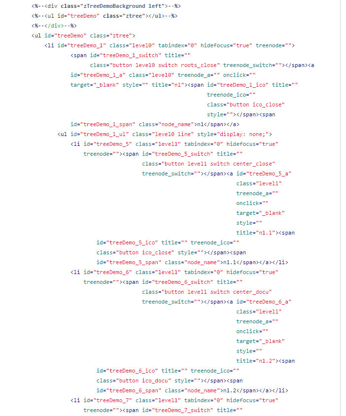

C:\\Users\\sziit\\Desktop\\捕获.PNG

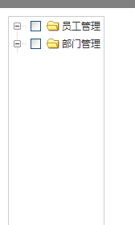

## 5.8 UI界面优化模块实现

功能描述：对Jsp的相关样式做的更加美观，结合操作经验部署模块。

运行与测试：

技术分析：通过网上的一些样式介绍资源文件，对显示页面一些编写和整合
